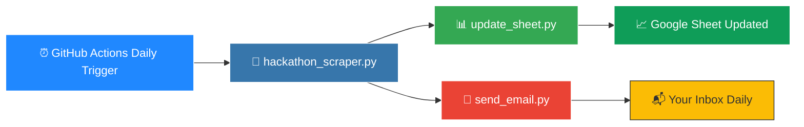

<div align="center">


<br/>

[](https://www.python.org/)
[](https://github.com/features/actions)
[](https://sheets.google.com/)
[](https://gmail.com/)
[](.)
[](.)

<br/>


<br/>

> 🎯 **The smartest way to stay on top of every Pakistani hackathon, without lifting a finger.**

</div>

---

## ✨ What Is This?

**Hackathon Tracker** is a fully automated pipeline that 🕷️ hunts down upcoming hackathons in Pakistan from Devpost, 📊 logs them into a Google Sheet, and 📧 emails you the fresh list every single day. Set it up once, let GitHub Actions do the rest. No credit card, no paid service, no manual work. 🚀

```
🔍 Scrape Devpost  ➜  📊 Update Sheet  ➜  📧 Send Email  ➜  😴 Repeat Daily
```

```
[=========================================] 100% Automated 🤖
 Scrape    Sync     Notify    Schedule    Done!
  🕷️        🔗        ✉️          ⏰         ✅
```

---

## 🧠 How It Works

<div align="center">



</div>

**Step by Step:**

1. 🕷️ **Scrape**, `hackathon_scraper.py` crawls Devpost and filters listings tagged with "Pakistan"
2. 🔗 **Sync**, scraped data is pushed to a Google Apps Script Web App via HTTP POST, which writes it into your Google Sheet
3. ✉️ **Notify**, `send_email.py` fires off a daily digest to your inbox via Gmail SMTP
4. ⏱️ **Automate**, `daily_update.yml` runs the entire pipeline on a GitHub Actions daily schedule with zero manual work

---

## 📁 Project Structure

```
hackathon-tracker/
│
├── 📂 .github/
│   └── 📂 workflows/
│       └── ⚙️ daily_update.yml        # Daily automation schedule
│
├── 🔒 .env                            # Local secrets (never committed)
├── 📄 .env.example                    # Template for required variables
├── 🚫 .gitignore                      # Files excluded from git
├── 🐍 hackathon_scraper.py            # Scrapes hackathon data from Devpost
├── 🐍 main.py                         # Orchestrates the full pipeline
├── 📘 README.md                       # You are here
├── 📦 requirements.txt                # Python dependencies
├── 🐍 send_email.py                   # Sends the daily email digest
└── 🐍 update_sheet.py                 # Pushes data to Google Sheets
```

---

## 🚀 Setup Guide

### 1️⃣ Create Your Google Sheet and Apps Script

<details open>
<summary><b>Click to expand</b></summary>
<br/>

1. 📊 Create a new **Google Sheet** or use an existing one
2. 🔧 Go to **Extensions** and then click **Apps Script**
3. 🗑️ Delete all default code and paste in a `doPost(e)` function that handles incoming JSON and writes rows to your sheet
4. ▶️ Click **Deploy**, choose **New Deployment**, set type to **Web App**, and set access to **Anyone**
5. 📋 Copy the **Web App URL**, you will need it as `WEB_APP_URL` in the next step

> ℹ️ The Apps Script acts as a serverless HTTP endpoint. Your Python script sends a POST request to it with the scraped data.

</details>

### 2️⃣ Configure Environment Variables

<details open>
<summary><b>Click to expand</b></summary>
<br/>

Copy `.env.example` to `.env` and fill in your actual values:

```bash
cp .env.example .env
```

```env
GMAIL_USER=your_email@gmail.com
GMAIL_APP_PASSWORD=your_16_character_app_password
WEB_APP_URL=https://script.google.com/macros/s/YOUR_DEPLOYMENT_ID/exec
WEB_APP_TOKEN=your_secret_token_to_authenticate_requests
```

**How to get each value:**

| Variable | How to Get It |
|:---------|:-------------|
| `GMAIL_USER` | Your Gmail address |
| `GMAIL_APP_PASSWORD` | Google Account, Security, then App Passwords (requires 2FA enabled) |
| `WEB_APP_URL` | Copied from your Apps Script deployment |
| `WEB_APP_TOKEN` | Any random secret string you choose, used to authenticate requests |

> 🔒 **Never commit your `.env` file to GitHub.** It is already listed in `.gitignore`.

</details>

### 3️⃣ Push to GitHub and Add Secrets

<details open>
<summary><b>Click to expand</b></summary>
<br/>

1. 📤 Push the project to your GitHub repository
2. ⚙️ Go to your repo on GitHub
3. 🔑 Navigate to **Settings** and then **Secrets and variables** and then **Actions**
4. ➕ Click **New repository secret** and add each variable:

```
GMAIL_USER           your_email@gmail.com
GMAIL_APP_PASSWORD   your_app_password
WEB_APP_URL          your_apps_script_url
WEB_APP_TOKEN        your_secret_token
```

5. ✅ GitHub Actions will now have secure access to all credentials at runtime

</details>

### 4️⃣ Let the Automation Take Over 🤖

<details open>
<summary><b>Click to expand</b></summary>
<br/>

Once secrets are set:

1. 🌿 Push any commit to the `main` branch to trigger the workflow manually
2. ⏰ The `daily_update.yml` workflow runs automatically on a daily schedule
3. 📬 Check your inbox the next morning for a fresh hackathon digest
4. 📊 Open your Google Sheet to see the updated listings

```
✅ That is it. No servers, no cron jobs, no cloud bills. Pure GitHub Actions magic.
```

</details>

---

## 🛠️ Tech Stack

<div align="center">

| Layer | Tool | Purpose |
|:------|:-----|:--------|
| 🕷️ **Scraping** | Python 3.10 with BeautifulSoup and Requests | Crawls Devpost for Pakistan hackathons |
| 📊 **Storage** | Google Sheets via Apps Script Web App | Stores and displays all scraped listings |
| 📧 **Notifications** | Gmail SMTP via Python smtplib | Sends daily email digest to your inbox |
| ⏰ **Automation** | GitHub Actions with cron schedule | Runs the full pipeline daily at zero cost |
| 🔐 **Secrets** | GitHub Repository Secrets | Stores credentials securely in the cloud |

</div>

<br/>

<div align="center">


&nbsp;

&nbsp;


</div>

---

## 🗂️ Files Reference

<div align="center">

| File | Emoji | Purpose |
|:-----|:-----:|:--------|
| `hackathon_scraper.py` | 🕷️ | Crawls Devpost and filters Pakistan hackathons |
| `update_sheet.py` | 📤 | Sends scraped data to the Google Sheet via Apps Script POST |
| `send_email.py` | 📧 | Composes and sends the daily Gmail SMTP digest |
| `main.py` | 🎬 | Entry point that orchestrates the full pipeline in sequence |
| `.github/workflows/daily_update.yml` | ⏱️ | GitHub Actions workflow that schedules the daily run |
| `.env.example` | 📄 | Template showing all required environment variable names |
| `requirements.txt` | 📦 | Lists all Python dependencies (beautifulsoup4, requests, etc.) |

</div>

---

## 🔥 Why This Project?

<div align="center">

| Problem | Solution |
|:--------|:---------|
| 😩 Manually checking Devpost every day | 🤖 Automated daily scrape at midnight |
| 😬 Missing registration deadlines | 📧 Email digest lands in your inbox every morning |
| 📉 Forgetting which hackathons you saw | 📊 Persistent Google Sheet log of all listings |
| 💸 Expensive automation tools | ✅ 100% free, zero credit card required |

</div>

---

## 📜 License

This project is currently **unlicensed**. All rights are reserved by the author unless stated otherwise. 🔐

---

## 👤 Author

<div align="center">

**Abdul Azeem Hashmi**

[](https://github.com/AbdulAzeemHashmi)

</div>

---

<div align="center">

### 💡 If this project saved you time, give it a ⭐ on GitHub!

[](https://github.com/AbdulAzeemHashmi/hackathon-tracker)

<br/>

Made with 🐍 Python and a lot of ☕


</div>