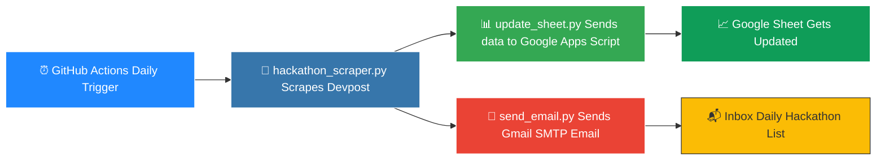

<div align="center">

# 🎯 Hackathon Tracker - Pakistan 🇵🇰

### Never miss a hackathon again. Fully automated. Completely free.


</div>

---

## ✨ What Is This?

A fully automated pipeline that hunts down upcoming hackathons in Pakistan, logs them into a Google Sheet, and emails you the fresh list every single day. Set it up once, let GitHub Actions do the rest. 🚀

```
🔍 Scrape  ➜  📊 Update Sheet  ➜  📧 Send Email  ➜  😴 Repeat Daily
```

---

## 🧠 How It Works



1. 🕷️ **Scrape** - `hackathon_scraper.py` crawls Devpost for hackathons tagged with "Pakistan".
2. 🔗 **Sync** - The data is pushed to a Google Apps Script Web App that writes it into a Google Sheet.
3. ✉️ **Notify** - `send_email.py` fires off an email via Gmail SMTP to your configured address.
4. ⏱️ **Automate** - A GitHub Actions workflow runs the entire thing on a daily schedule. No manual work needed.

---

## 📁 Project Structure

```
hackathon-tracker/
│
├── 📂 .github/
│   └── 📂 workflows/
│       └── ⚙️ daily_update.yml      # Daily automation schedule
│
├── 🔒 .env                          # Local secrets (never committed)
├── 📄 .env.example                  # Template for required variables
├── 🚫 .gitignore                    # Files excluded from git
├── 🐍 hackathon_scraper.py          # Scrapes hackathon data
├── 🐍 main.py                       # Orchestrates the full pipeline
├── 📘 README.md                     # You are here
├── 📦 requirements.txt              # Python dependencies
├── 🐍 send_email.py                 # Sends the daily email
└── 🐍 update_sheet.py               # Pushes data to Google Sheets
```

---

## 🚀 Setup Guide

### 1️⃣ Create Your Google Sheet
Set up a Google Sheet and deploy an Apps Script Web App using the provided `doPost` function.

### 2️⃣ Configure Environment Variables
Copy `.env.example` to `.env` and fill in the values:

```env
GMAIL_USER=your_email@gmail.com
GMAIL_APP_PASSWORD=your_app_password
WEB_APP_URL=your_google_apps_script_url
WEB_APP_TOKEN=your_secret_token
```

### 3️⃣ Push and Add Secrets
Push the project to GitHub, then add the same variables as **Repository Secrets** under:

`Settings ➜ Secrets and variables ➜ Actions`

### 4️⃣ Let Automation Take Over 🤖
The workflow in `daily_update.yml` runs automatically. Sit back and let the hackathons come to you. 🎉

---

## 🛠️ Tech Stack

| Layer | Tool |
|-------|------|
| 🐍 Scraping | Python + BeautifulSoup / Requests |
| 📊 Storage | Google Sheets via Apps Script |
| 📧 Notifications | Gmail SMTP |
| ⏰ Automation | GitHub Actions |

---

## 🗂️ Files Reference

| File | Purpose |
|------|---------|
| `hackathon_scraper.py` | 🔍 Scrapes hackathon data from Devpost |
| `update_sheet.py` | 📤 Sends scraped data to the Google Sheet |
| `send_email.py` | 📧 Sends the daily email digest |
| `main.py` | 🎬 Orchestrates the whole pipeline |
| `.github/workflows/daily_update.yml` | ⏱️ Schedules the daily automation |

---

## 📜 License

This project currently has **no license**. All rights reserved by the author unless stated otherwise. 🔐

---

## 👤 Author

<div align="center">

**Abdul Azeem Hashmi**

[](https://github.com/AbdulAzeemHashmi)

</div>

---

<div align="center">

### 💡 If this project saved you time, consider giving it a ⭐

Made with 🐍 Python and a lot of ☕

</div>